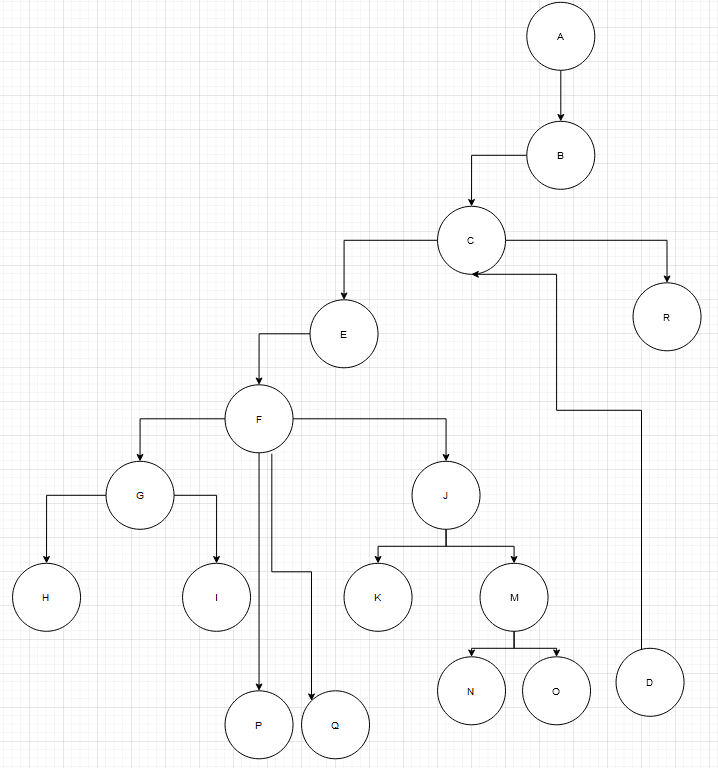

# Втора лабораториска вежба по Софтверско инженерство
## Стефан Тасевски, бр. на индекс 183122
### Control Flow Graph

### Цикломатска комплексност
Цикломатската комплексност е 1. Вредноста ја добив преку формулата E-N+2 каде E е бројот на ребра (16), а N е бројот на јазли (17).
